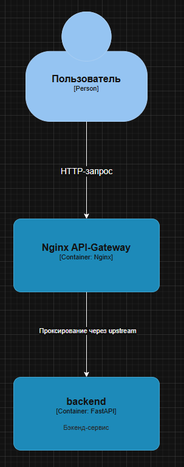

# Effective_Mobile_test_task 
## Как запустить проект
Выполнить в терминале в директории проекта

```docker compose up -d```
## Как проверить результат
Выполнить в терминале

```curl http://localhost```
## Как работает приложение


1. Пользователь отправляет HTTP-запрос на адрес Nginx
2. Nginx проксирует запрос на адрес бэкенд-сервиса

Путь запроса имеет следующий вид:
Пользователь ->  nginx -> backend
Важно: наружу смотрит только порт Nginx. Маршрутизация между Nginx и сервисом бэкедна происходит во внутренней сети docker compose.

3. В бэкенд-сервисе вызывается функция по пути /, которая возвращает ответ обратно пользователю по обратному пути (backend -> nginx -> пользователь)